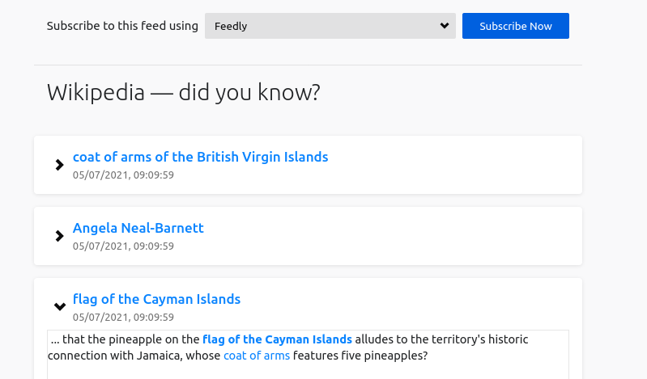

# Feed me up, Scotty!

RSS feeds for arbitrary websites, using [CSS selectors](https://developer.mozilla.org/en-US/docs/Learn/CSS/Building_blocks/Selectors).
_Feed me up, Scotty!_ is:

- straightforward to set up.
- runs on GitHub Actions, GitLab CI/CD, or wherever floats your boat.
- uses an actual browser to fetch data.

Here's an example config:

```toml title=feeds.toml
[funfacts]
title = "Wikipedia — did you know?"
url = "https://en.wikipedia.org/wiki/Main_Page"
entrySelector = "#mp-dyk > ul li"
titleSelector = "b"
linkSelector = "b a"

[wikivoyage]
title = "Wikivoyage recommendations"
url = "https://en.wikivoyage.org/wiki/Main_Page"
entrySelector = ".jcarousel-wrapper .jcarousel-item"
titleSelector = "h2"
linkSelector = "h2 a"
```

…which turns into
[`funfacts.xml`](https://vincenttunru.gitlab.io/feeds/funfacts.xml) and
[`wikivoyage.xml`](https://vincenttunru.gitlab.io/feeds/wikivoyage.xml).



Learn more about [the configuration file](docs/setup), or [set up automatic feed
generation](docs/automate) using GitHub or GitLab.
